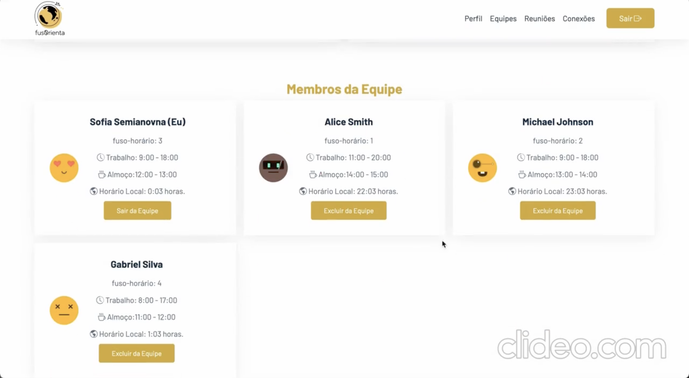

# FusOrienta

O FusOrienta busca auxiliar viajantes, tanto a trabalho quanto para férias e afins, a cerca da conversão de moeda e status economico
e orientar os melhores horários de conexões de chamadas entre países tendo em vista os diferentes fusos horários

## Alunos integrantes da equipe

- Bernardo Elias Renttins Vasconcelos de Sousa
- João Augusto Aquino Campelo
- Juliana Parreiras Guimarães da Cunha
- Lara Lima Pereira
- Pedro Henrique Marques de Oliveira
- Rodrigo Garcia Ribas

## Professores responsáveis

- Cleiton Silva Tavares
- Thiago Augusto Nicolini Silva

## Instruções de utilização

Cadastre-se agora para participar! Caso você não seja o primeiro participante, não se preocupe, outros usuários estarão disponíveis para serem conectados. Além disso, você poderá enviar convites para outras pessoas e decidir se deseja aceitar ou recusar os convites recebidos. Também é possível excluir pessoas da sua lista de conexões.

Dentro do sistema, você terá a capacidade de criar e excluir equipes, bem como adicionar seus contatos às equipes. Cada equipe terá sugestões de horários para reuniões, levando em consideração os fusos horários de cada participante. Além disso, o sistema realizará conversões de moeda para as conexões que estão dentro da equipe.

Na aba de "Reuniões Semanais", você poderá visualizar todas as reuniões agendadas dentro das equipes correspondentes. Caso haja uma reunião agendada para o dia, você receberá um alerta para não perder o compromisso. Além disso, você terá acesso ao seu perfil, onde poderá editar e visualizar suas informações pessoais.

Não perca mais tempo e faça seu cadastro agora mesmo para desfrutar de todas essas funcionalidades e facilitar sua comunicação e organização de equipes!
