## 6. Interface do sistema

Visão geral da interação do usuário pelas telas do sistema. Apresente as principais interfaces da plataforma.

## 6.1 Telas do processo 1

A tela de cadastro de usuário é pensada para obter as informações essenciais do usuário de forma clara e eficiente. Abaixo está uma descrição dos campos presentes na tela:

1.	Nome Completo: Um campo de texto que permite ao usuário inserir seu nome completo. Pode incluir validações para garantir a precisão e a formatação adequada.
2.	Data de Nascimento: Um seletor de data que possibilita ao usuário escolher sua data de nascimento. Pode incluir um recurso que valida a idade para garantir que o usuário atenda aos requisitos mínimos de cadastro.
3.	CPF: Um campo numérico destinado à inserção do CPF do usuário. Inclui validações para garantir um formato adequado e verificar a validade do CPF.
4.	Telefone: Um campo destinado ao número de telefone do usuário. Pode incluir máscaras para facilitar a entrada de dados e validações para garantir um formato correto.
5.	Endereço: Campos separados para rua, número, bairro, cidade, estado e CEP, possibilitando ao usuário fornecer seu endereço completo.
6.	Email: Um campo de texto para inserção do endereço de e-mail do usuário. Inclui validações para garantir que o endereço de e-mail seja válido e único no sistema.
7.	Senha: Um campo seguro para a inserção da senha desejada pelo usuário. A senha deve atender a critérios de segurança, como comprimento mínimo, caracteres especiais, letras maiúsculas e números.
8.	Confirmação de Senha: Um campo adicional para que o usuário confirme a senha digitada anteriormente, a fim de evitar erros de digitação.
9.	Botão de Cadastro: Um botão destacado que, quando acionado, valida todos os campos preenchidos e, se estiverem corretos, realiza o cadastro do usuário.
10.	Botão de Login: Um botão destacado que oferece ao usuário retornar para a tela de login, caso o mesmo já possua um cadastro no sistema.

A tela de login foi projetada para proporcionar aos usuários uma entrada rápida e segura ao sistema. Abaixo está uma descrição dos elementos presentes nesta tela:

1.	Campo de Email: Um campo de texto para inserção do endereço de e-mail do usuário. Inclui validações para garantir que o formato seja válido e que o endereço esteja registrado no sistema.
2.	Campo de Senha: Um campo seguro para a inserção da senha do usuário. Deve incluir opções para ocultar/mostrar a senha, proporcionando flexibilidade ao usuário.
3.	Botão de Login:Um botão proeminente que, quando acionado, valida as credenciais inseridas nos campos de e-mail e senha. Se as credenciais estiverem corretas, o usuário é redirecionado para a área restrita do sistema.
4.	Link "Cadastre-e agora!": Um link direcionando para a tela de cadastro, convidando os usuários que ainda não têm uma conta a criar uma. Este link leva a uma página de registro onde o usuário pode preencher as informações necessárias.
5.	Mensagens de Erro: Áreas designadas para exibir mensagens de erro caso as credenciais inseridas sejam inválidas ou se ocorrerem outros problemas durante o processo de login. Além disso, uma área para fornecer feedback positivo após um login bem-sucedido.

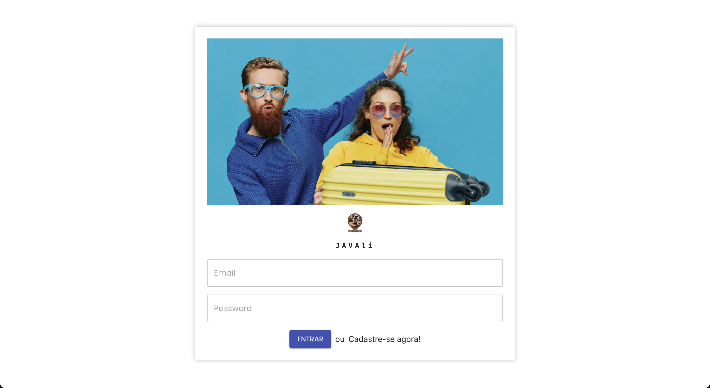

A tela de perfil e edição de cadastro foi projetada para fornecer aos usuários um local centralizado para visualizar e ajustar suas informações. Abaixo está uma descrição dos elementos presentes nesta tela:

1.	Campo de Email (Fixo): Um campo não editável que exibe o endereço de e-mail associado à conta do usuário. Essa informação é fixa e não pode ser alterada nesta tela.
2.	Campo de CPF (Fixo): Um campo não editável que exibe o número de CPF associado à conta do usuário. Semelhante ao e-mail, essa informação é fixa e não pode ser alterada nesta tela.
3.	Campo de Nome Completo (Alterável): Um campo de texto onde o usuário pode editar seu nome completo. Inclui validações para garantir precisão e formatação adequada.
4.	Campo de Data de Nascimento (Alterável): Um seletor de data que permite ao usuário modificar sua data de nascimento. Pode incluir validações para garantir que a idade mínima seja atingida após as alterações.
5.	Campos de Endereço (Alteráveis): Campos separados para rua, número, bairro, cidade, estado e CEP, permitindo ao usuário editar seu endereço. Inclui validações para garantir a precisão e a formatação adequada.
6.	Botão de Salvar Alterações: Um botão proeminente que, quando acionado, salva as alterações feitas nos campos editáveis, atualizando as informações do perfil do usuário.
7.	Botão de Inativar Conta: Um botão que, quando acionado, abre um diálogo de confirmação para inativar a conta do usuário. Após a confirmação, a conta é desativada, mas as informações ainda podem ser mantidas no sistema por razões de auditoria.
8.	Mensagens de Sucesso e Erro: Áreas designadas para exibir mensagens de sucesso após a edição ou inativação bem-sucedida, assim como mensagens de erro caso ocorram problemas durante o processo.

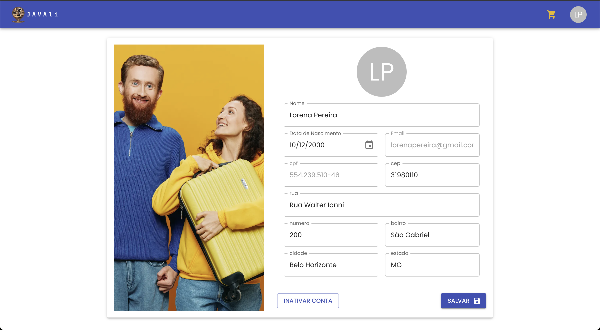

Ao acionar o botão "Inativar Conta" na tela de perfil e edição de cadastro, uma notificação é exibida para confirmar a ação. A notificação apresenta a seguinte mensagem:
"Tem Certeza que Deseja Inativar Conta?"

A notificação é projetada de maneira clara e direta, fornecendo ao usuário uma oportunidade de revisar e confirmar sua decisão antes de prosseguir. Além da mensagem principal, a notificação inclui dois botões:

1.	Botão "Cancelar": Este botão permite ao usuário cancelar a ação de inativação da conta. Se selecionado, a notificação será fechada, e nenhuma alteração na conta será realizada.
2.	Botão "Inativar Conta": Este botão confirma a decisão de inativar a conta do usuário. Se selecionado, a notificação será fechada, e a conta será marcada como inativa. após a inativação da conta, o usuário não consegue mais efetuar login enquanto permanecer inativo.

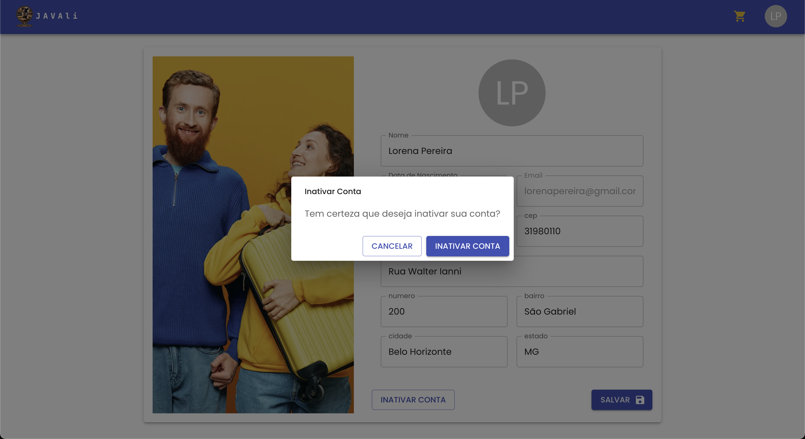

## 6.2 Telas do processo 2

### 6.2.1 Hospedagem

A tela de cadastro de produto para hospedagem foi projetada para facilitar o registro e a gestão de informações sobre diferentes locais de hospedagem. Abaixo está uma descrição dos campos presentes nesta tela:

1.	Campo Título: Um campo de texto que permite ao usuário inserir um título descritivo para a hospedagem, destacando suas características ou nome.
2.	Campos Check-In e Check-Out: Seletor de datas e horário que permite ao usuário definir a disponibilidade da hospedagem, indicando a data de check-in e a data de check-out.
3.	Campo Descrição: Uma área de texto expandida onde o usuário pode fornecer uma descrição detalhada da hospedagem, incluindo comodidades e características especiais.
4.	Campo Valor Diária: Um campo numérico para inserção do valor da diária da hospedagem.
5.	Campo Área em m²: Um campo numérico para inserção da área total em metros quadrados da hospedagem.
6.	Campos Quantidade de Quartos e Banheiros: Campos numéricos para indicar a quantidade de quartos e banheiros na hospedagem.
7.	Campo Capacidade Máxima de Pessoas: Um campo numérico para inserção do número máximo de pessoas que a hospedagem pode acomodar.
8.	Campo Endereço da Hospedagem: Campos separados para rua, número, bairro, cidade, estado e CEP, permitindo ao usuário inserir o endereço completo da hospedagem.
9.	Botão para Carregar Imagens da Hospedagem: Um botão que permite ao usuário carregar imagens da hospedagem, facilitando a visualização e apresentação do local. Pode abrir uma interface para upload de imagens.
10.	Botão de Salvar: Um botão proeminente que, quando acionado, valida todos os campos preenchidos e salva as informações da hospedagem no sistema.

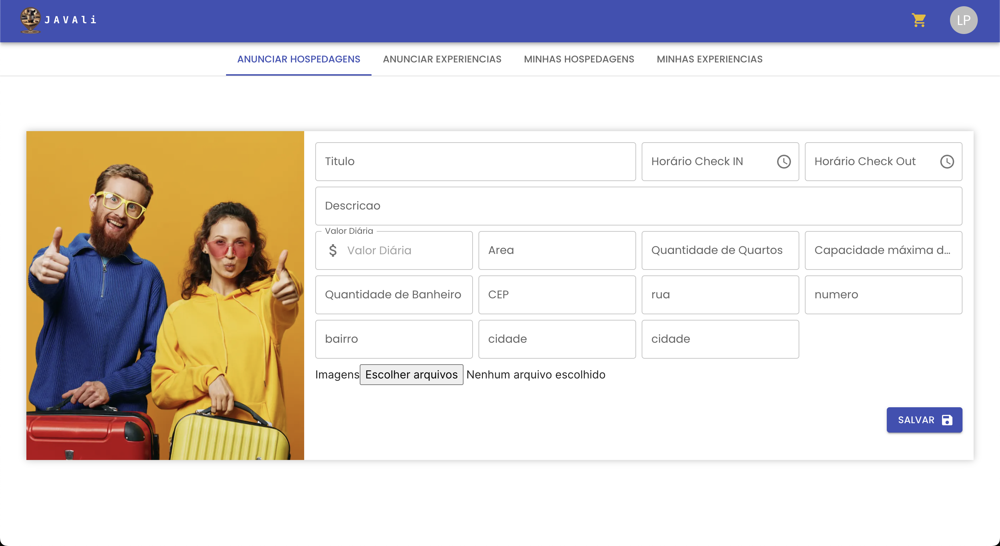

A tela de edição de hospedagem proporciona ao usuário a capacidade de modificar e atualizar informações previamente inseridas. Abaixo está uma descrição dos elementos presentes nesta tela:

1.	Campo Título (Editável): Um campo de texto que permite ao usuário editar o título descritivo da hospedagem.
2.	Campos Check-In e Check-Out (Editáveis): Seletor de datas que possibilita ao usuário ajustar a disponibilidade da hospedagem, modificando as datas de check-in e check-out.
3.	Campo Descrição (Editável): Uma área de texto expandida onde o usuário pode modificar a descrição detalhada da hospedagem, incluindo comodidades e características especiais.
4.	Campo Valor Diária (Editável): Um campo numérico para inserção ou modificação do valor da diária da hospedagem.
5.	Campo Área em m² (Editável): Um campo numérico que permite ao usuário ajustar a área total em metros quadrados da hospedagem.
6.	Campos Quantidade de Quartos e Banheiros (Editáveis): Campos numéricos para que o usuário possa modificar a quantidade de quartos e banheiros na hospedagem.
7.	Campo Capacidade Máxima de Pessoas (Editável): Um campo numérico para inserção ou edição do número máximo de pessoas que a hospedagem pode acomodar.
8.	Campo Endereço da Hospedagem (Editável): Campos separados para rua, número, complemento, bairro, cidade, estado e CEP, permitindo ao usuário editar o endereço completo da hospedagem.
9.	Botão para Carregar Imagens da Hospedagem: Um botão que permite ao usuário adicionar ou editar imagens da hospedagem. Pode abrir uma interface para upload ou edição das imagens.
10.	Botão para Criar Cupom de Desconto: Um botão que direciona o usuário para uma tela ou modal onde ele pode criar um cupom de desconto específico para a hospedagem. Esse recurso pode ser útil para promoções especiais.
11.	Botão de Editar Informações: Um botão proeminente que, quando acionado, valida todas as alterações feitas nos campos editáveis e salva as informações atualizadas da hospedagem no sistema.

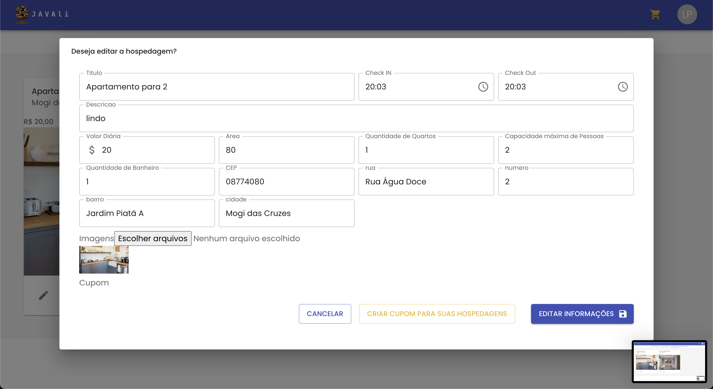

A tela de visualização de minhas hospedagens oferece ao usuário uma visão consolidada das propriedades de hospedagem cadastradas. Abaixo está uma descrição dos elementos presentes nesta tela:

1.	Lista de Hospedagens Cadastradas: Uma visualização em grade das hospedagens cadastradas pelo usuário, apresentando informações essenciais, como título, localização e status de disponibilidade.
2.	Botão "Anunciar Hospedagens": Um botão proeminente que leva o usuário para a tela de cadastro de hospedagens, permitindo adicionar novas propriedades de hospedagem.
3.	Botão "Anunciar Experiências": Um botão que direciona o usuário para a tela de cadastro de experiências, caso ofereça além de hospedagens, outras atividades ou serviços relacionados.
4.	Botão "Minhas Hospedagens": Um botão que leva o usuário para a tela de visualização exclusiva de suas hospedagens cadastradas.
5.	Botão "Minhas Experiências": Um botão que direciona o usuário para a tela de visualização exclusiva de suas experiências cadastradas, caso ofereça essa funcionalidade.
6.	Botão de Edição de Hospedagem: Abaixo de cada hospedagem listada, um botão de edição permite ao usuário realizar alterações nas informações da hospedagem. Isso redireciona para a tela de edição correspondente.
7.	Botão de Exclusão de Hospedagem: Abaixo de cada hospedagem listada, um botão de exclusão permite ao usuário remover a hospedagem do sistema, acompanhado de uma confirmação para evitar exclusões acidentais.

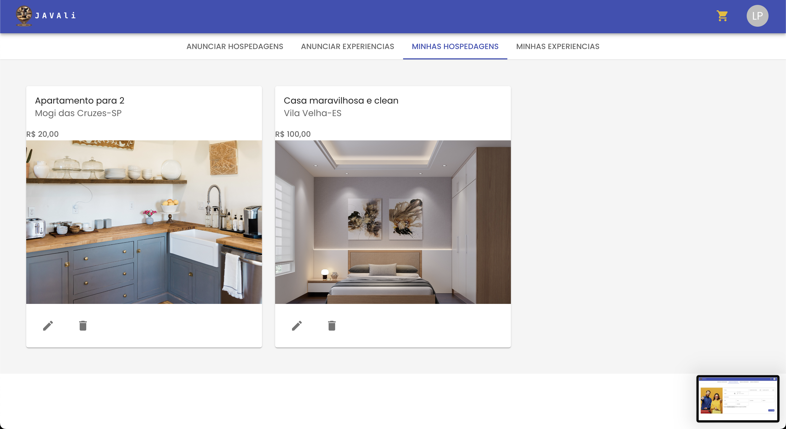

Ao acionar o botão "Excluir Hospedagem" na tela de visualização de minhas hospedagens, uma notificação é exibida para confirmar a ação. A notificação apresenta a seguinte mensagem:
"Tem Certeza que Deseja Excluir Hospedagem?"
A notificação é projetada para ser clara e direta, fornecendo ao usuário a oportunidade de confirmar ou cancelar a exclusão da hospedagem. Além da mensagem principal, a notificação inclui dois botões:

1.	Botão "Cancelar": Este botão permite ao usuário cancelar a ação de exclusão da hospedagem. Se selecionado, a notificação será fechada, e nenhuma alteração será realizada.
2.	Botão "Confirmar": Este botão confirma a decisão de excluir a hospedagem. Se selecionado, a notificação será fechada, e a hospedagem será removida do sistema. Antes de efetivar a exclusão, é recomendável incluir uma confirmação adicional para evitar exclusões acidentais.

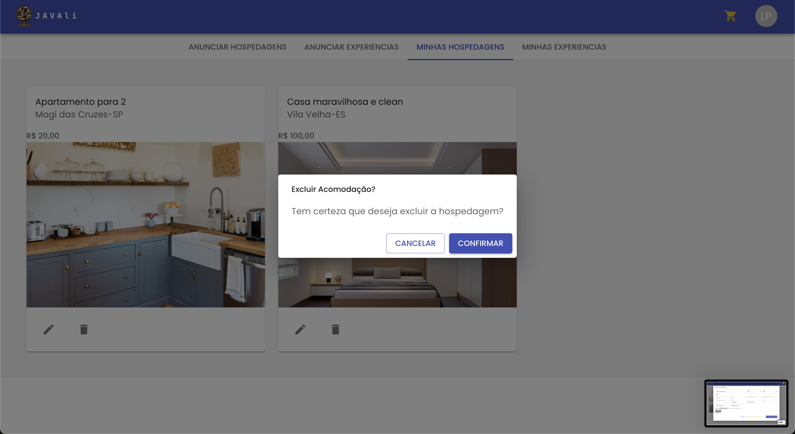

### 6.2.2 Experiências

A tela de cadastro de experiências foi projetada para facilitar o registro e a gestão de informações sobre diferentes atividades ou serviços oferecidos. Abaixo está uma descrição dos campos presentes nesta tela:

1.	Campo Título: Um campo de texto que permite ao usuário inserir um título descritivo para a experiência, destacando suas características ou nome.
2.	Campos Horário de Início e Horário de Fim: Seletor de horário que possibilita ao usuário definir o horário de início e o horário de término da experiência.
3.	Campo Data: Um seletor de data que permite ao usuário escolher a data em que a experiência será realizada.
4.	Campo Valor: Um campo numérico para inserção do valor da experiência.
5.	Campo Descrição: Uma área de texto expandida onde o usuário pode fornecer uma descrição detalhada da experiência, incluindo atividades planejadas e outros detalhes relevantes.
6.	Campo Endereço da Experiência: Campos separados para rua, número, bairro, cidade, estado e CEP, permitindo ao usuário inserir o endereço completo da experiência.
7.	Botão para Carregar Imagens da Experiência: Um botão que permite ao usuário carregar imagens relacionadas à experiência, contribuindo para uma apresentação visual atraente do evento ou atividade.
8.	Botão de Salvar: Um botão proeminente que, quando acionado, valida todos os campos preenchidos e salva as informações da experiência no sistema.

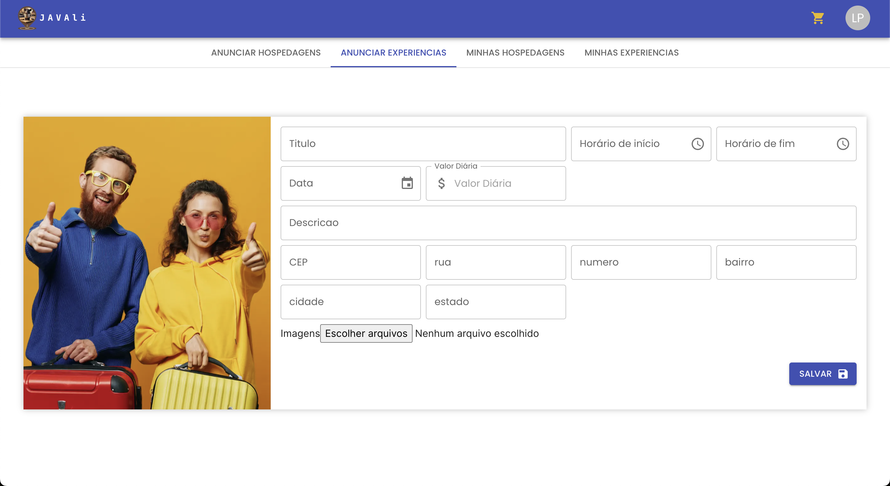

A tela de edição de experiências oferece ao usuário a capacidade de modificar e atualizar informações previamente inseridas sobre atividades ou serviços oferecidos. Abaixo está uma descrição dos elementos presentes nesta tela:

1.	Campo Título (Editável): Um campo de texto que permite ao usuário editar o título descritivo da experiência.
2.	Campos Horário de Início e Horário de Fim (Editáveis): Seletor de horário que possibilita ao usuário ajustar o horário de início e o horário de término da experiência.
3.	Campo Data (Editável): Um seletor de data que permite ao usuário modificar a data em que a experiência será realizada.
4.	Campo Valor (Editável): Um campo numérico para inserção ou modificação do valor da experiência.
5.	Campo Descrição (Editável): Uma área de texto expandida onde o usuário pode ajustar a descrição detalhada da experiência, incluindo atividades planejadas e outros detalhes relevantes.
6.	Campo Endereço da Experiência (Editável): Campos separados para rua, número, complemento, bairro, cidade, estado e CEP, permitindo ao usuário editar o endereço completo da experiência.
7.	Botão para Carregar Imagens da Experiência: Um botão que permite ao usuário adicionar ou editar imagens relacionadas à experiência. Pode abrir uma interface para upload ou edição das imagens.
8.	Botão de Salvar Alterações: Um botão proeminente que, quando acionado, valida todas as alterações feitas nos campos editáveis e salva as informações atualizadas da experiência no sistema.

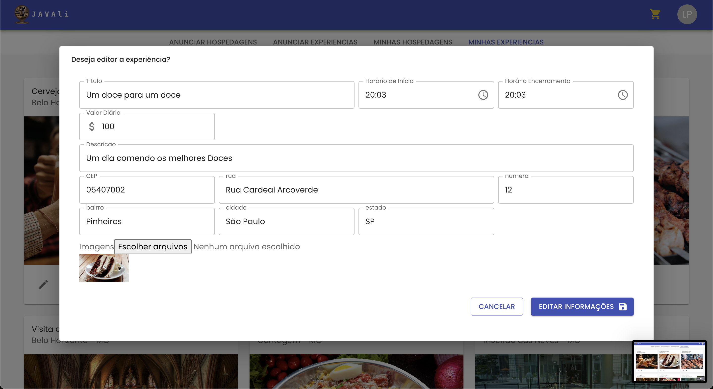

A tela de visualização de minhas experiências oferece uma visão consolidada das atividades ou serviços cadastrados. Abaixo está uma descrição dos elementos presentes nesta tela:

1.	Lista de Experiências Cadastradas: Uma visualização em lista ou grade das experiências cadastradas pelo usuário, apresentando informações essenciais, como título, localização e datas.
2.	Botão "Anunciar Experiências": Um botão proeminente que leva o usuário para a tela de cadastro de experiências, permitindo adicionar novas atividades ou serviços.
3.	Botão "Anunciar Hospedagens": Um botão que direciona o usuário para a tela de cadastro de hospedagens, caso também ofereça propriedades de hospedagem.
4.	Botão "Minhas Experiências": Um botão que leva o usuário para a tela de visualização exclusiva de suas experiências cadastradas.
5.	Botão "Minhas Hospedagens": Um botão que direciona o usuário para a tela de visualização exclusiva de suas hospedagens cadastradas, caso também ofereça esse serviço.
6.	Botão de Edição de Experiência: Ao lado de cada experiência listada, um botão de edição permite ao usuário realizar alterações nas informações da experiência. Isso redireciona para a tela de edição correspondente.
7.	Botão de Exclusão de Experiência: Ao lado de cada experiência listada, um botão de exclusão permite ao usuário remover a experiência do sistema. Deve ser acompanhado de uma confirmação para evitar exclusões acidentais.

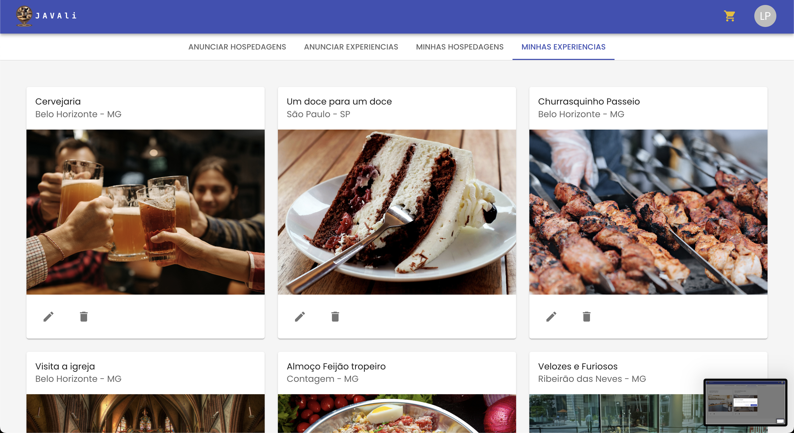

Ao acionar o botão "Excluir Experiência" na tela de visualização de minhas experiências, uma notificação é exibida para confirmar a ação. A notificação apresenta a seguinte mensagem:
"Tem Certeza que Deseja Excluir Experiência?"
A notificação é projetada para ser clara e direta, fornecendo ao usuário a oportunidade de confirmar ou cancelar a exclusão da experiência. Além da mensagem principal, a notificação inclui dois botões:

1.	Botão "Cancelar": Este botão permite ao usuário cancelar a ação de exclusão da experiência. Se selecionado, a notificação será fechada, e nenhuma alteração será realizada.
2.	Botão "Confirmar": Este botão confirma a decisão de excluir a experiência. Se selecionado, a notificação será fechada, e a experiência será removida do sistema. Antes de efetivar a exclusão, é recomendável incluir uma confirmação adicional para evitar exclusões acidentais.

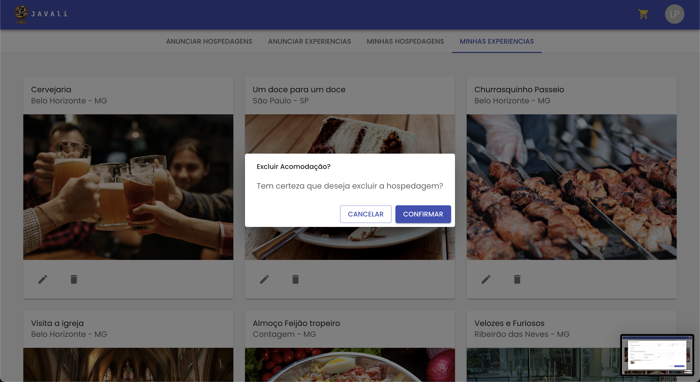

## 6.3 Telas do processo 3

O processo de cadastro de cupons tem início na tela de "Minhas Hospedagens", onde os usuários podem visualizar informações sobre suas estadias e cadastrar novos cupons relacionados a essas hospedagens. Ao clicar no botão "Criar Cupom para Suas Hospedagens", um modal é aberto, solicitando informações para o cadastro do cupom.

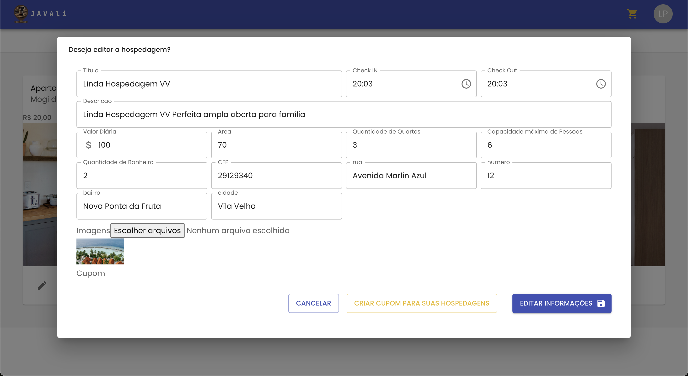

Dentro do modal de cadastro de novo cupom, são requisitadas informações específicas sobre o cupom a ser cadastrado, como título, código e valor do desconto. Após preencher todas essas informações, é possível salvar o cupom da hospedagem no sistema ao clicar no botão "Confirmar".

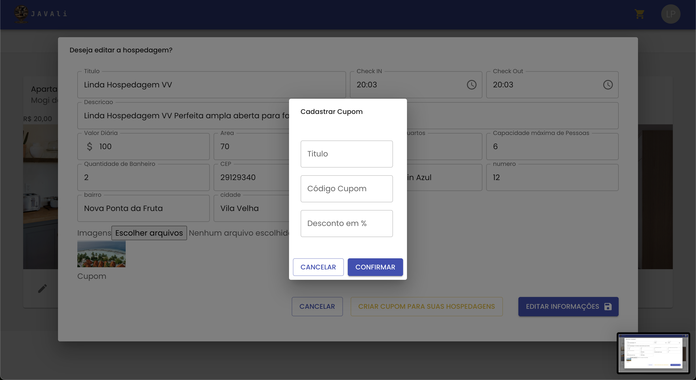

Uma vez cadastrado um cupom para uma hospedagem, o mesmo será exibido na tela de informações dessa hospedagem, incluindo dados como a porcentagem de desconto, título e código do cupom. Além disso, são disponibilizados dois botões para copiar o código do cupom e inativar o cupom.

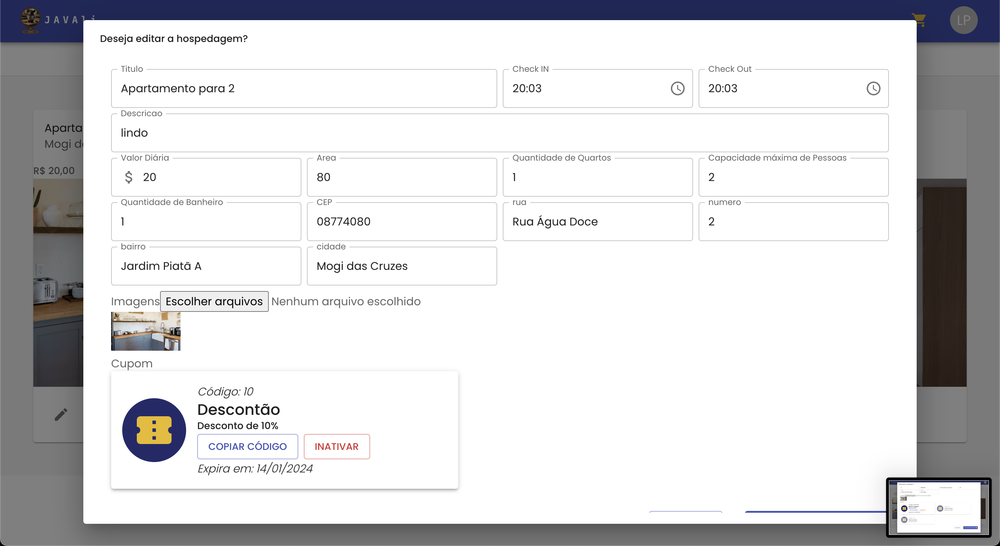

Para cupons inativos, eles serão apresentados com uma coloração mais clara em comparação aos cupons ativos, facilitando a identificação visual.

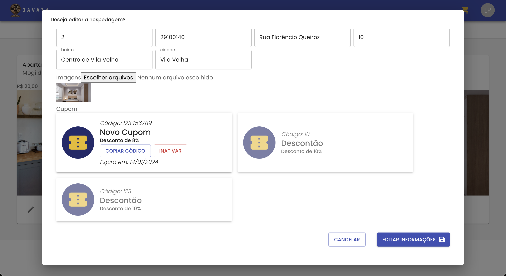

Cada usuário receberá um cupom, o qual poderá ser utilizado em um produto à sua escolha a cada 10 compras efetuadas na aplicação. Esses cupons serão exibidos na tela de "Meus Cupons", organizados em duas abas: uma para os cupons ativos e outra para os inativos.

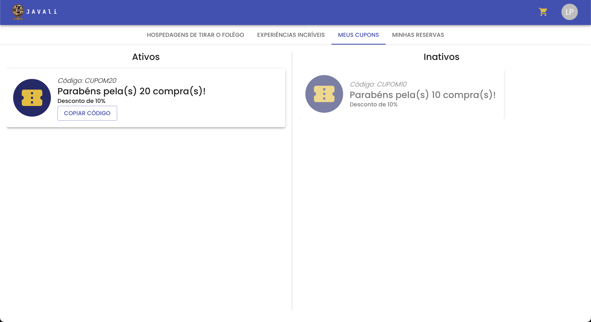

## 6.4 Telas do processo 4

Quando o carrinho de um usuário estiver vazio, ou seja, sem nenhum produto selecionado para compra, uma mensagem será exibida informando sobre a situação do carrinho, juntamente com um botão para fechar esse modal.

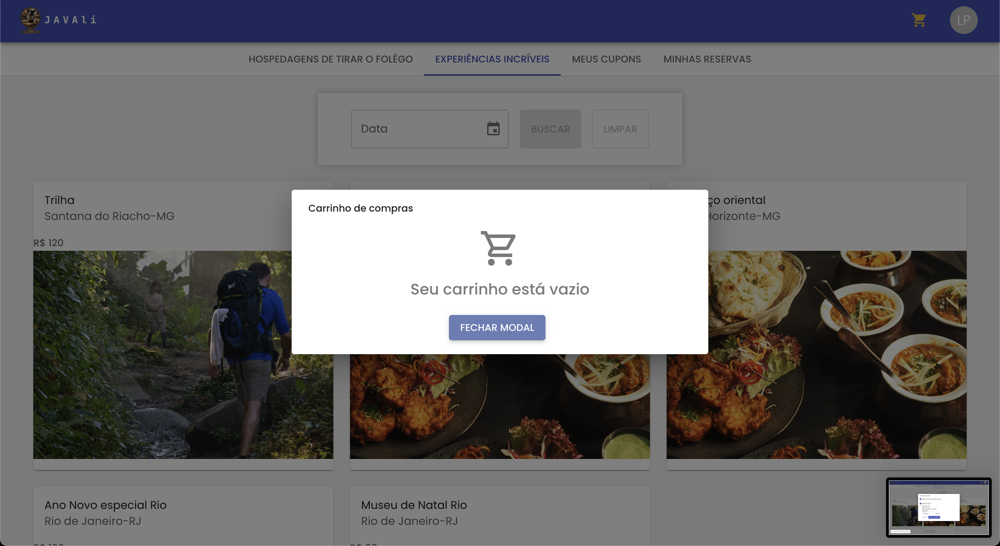

Ao clicar em uma experiência, um modal será aberto apresentando informações detalhadas sobre a mesma para a compra. O usuário poderá selecionar a data desejada para a experiência e utilizar o botão "Adicionar ao Carrinho" para incluir o produto na lista de compras.

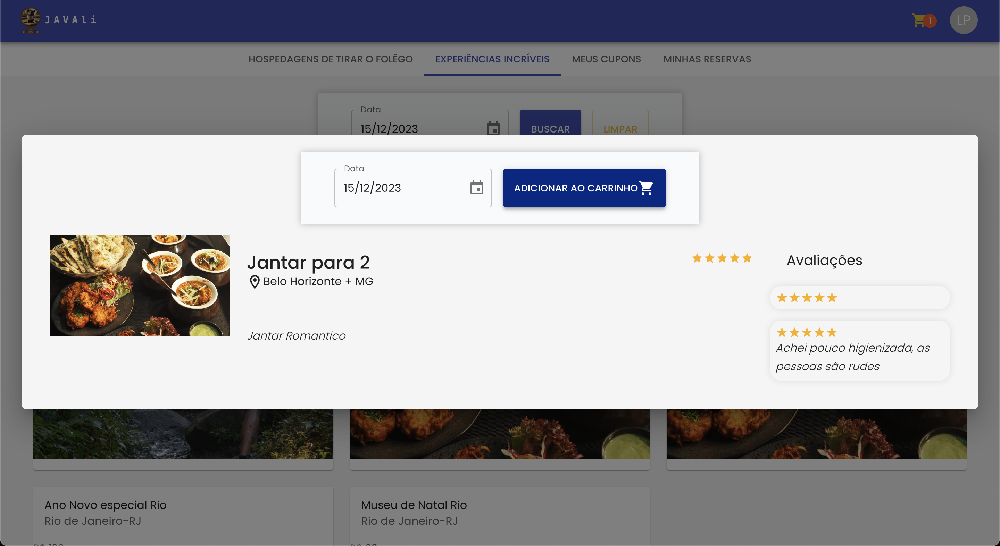

Da mesma forma, ao clicar em uma hospedagem, um modal será exibido, solicitando ao usuário a data de check-in e check-out, com um botão "Adicionar ao Carrinho" para incluir essa hospedagem na lista de compras do usuário.

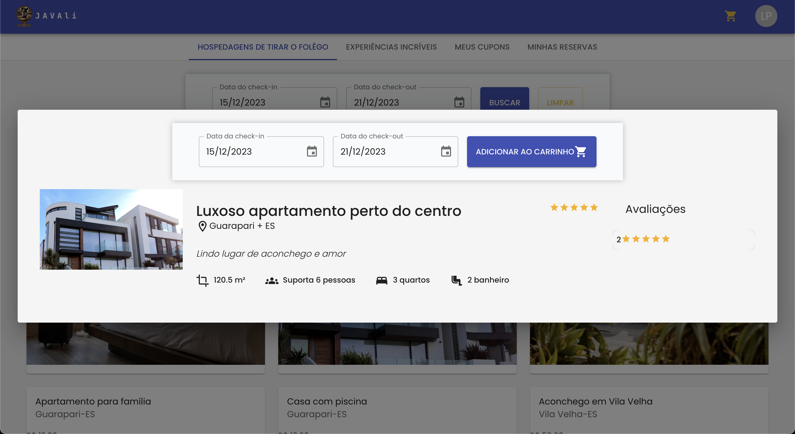

Após adicionar produtos ao carrinho, o usuário receberá informações sobre os itens selecionados, incluindo o preço total e o nome dos produtos. Ele pode excluir itens do carrinho antes de prosseguir, clicando no botão "Continuar".

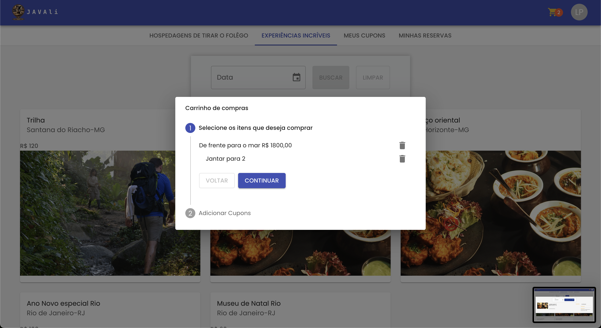

Se nenhum cupom foi aplicado, o usuário verá apenas o valor total da compra, com a opção de aplicar um cupom. Um campo de texto aguarda o código do cupom válido, ou o usuário pode optar por continuar a compra sem aplicar um cupom.

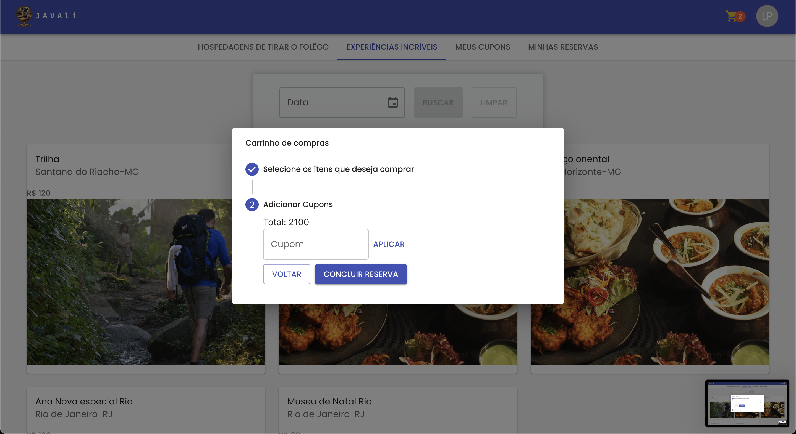

Ao aplicar um cupom, o novo valor da compra, com o desconto do cupom aplicado, será exibido ao usuário. Ele terá a opção de prosseguir com a compra.

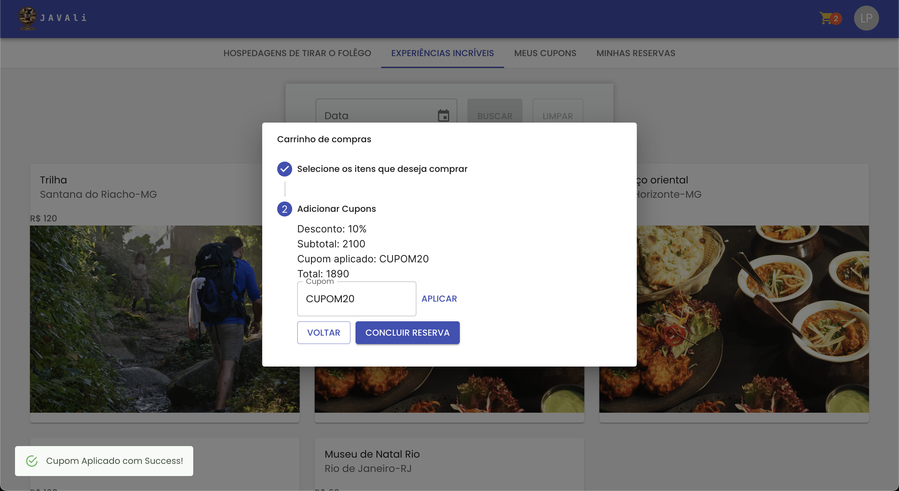

Na tela "Minhas Reservas", o usuário encontrará todas as compras realizadas na aplicação, com a possibilidade de expandi-las para ver informações mais detalhadas, como preço, tempo de estadia e nome da hospedagem ou experiência escolhida.

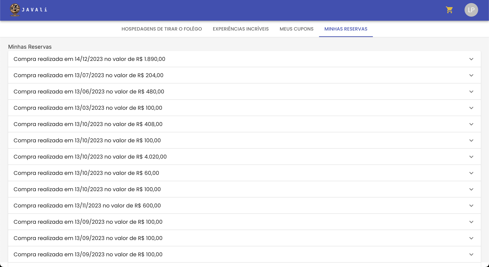

## 6.5. Processo 5

Quando um produto ainda não foi avaliado pelo usuário, é oferecida a oportunidade de avaliação por meio do botão "Avaliar".

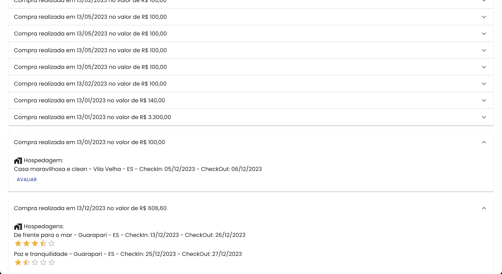

Ao clicar no botão "Avaliar", um modal é aberto, solicitando a opinião do usuário sobre o produto. O usuário expressa sua avaliação por meio de estrelas em uma escala de 0 a 5. Se a avaliação for negativa, é disponibilizado um campo de texto para o usuário fornecer detalhes específicos sobre seu feedback.

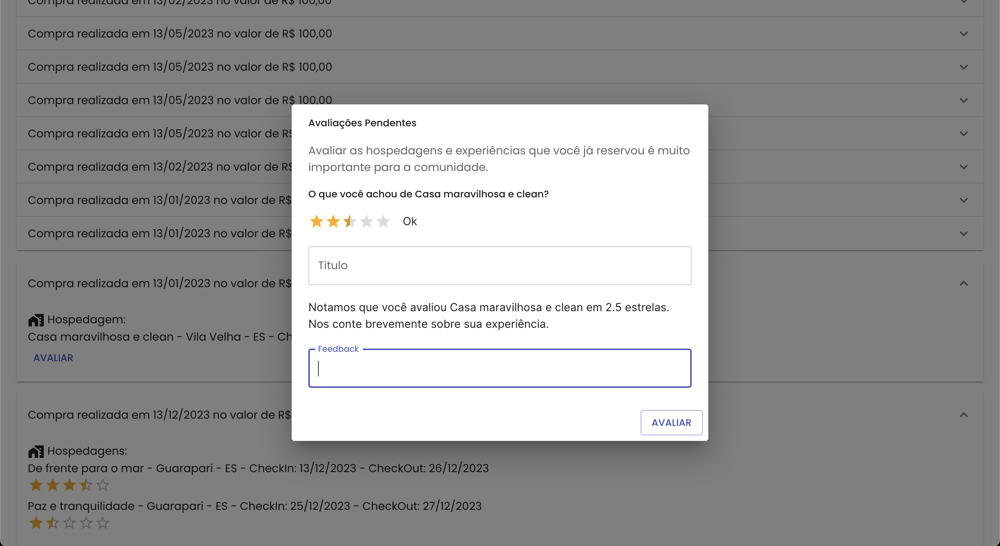

No caso de uma avaliação positiva, não é necessário que o usuário forneça comentários adicionais. A avaliação é salva diretamente com base nas estrelas atribuídas.

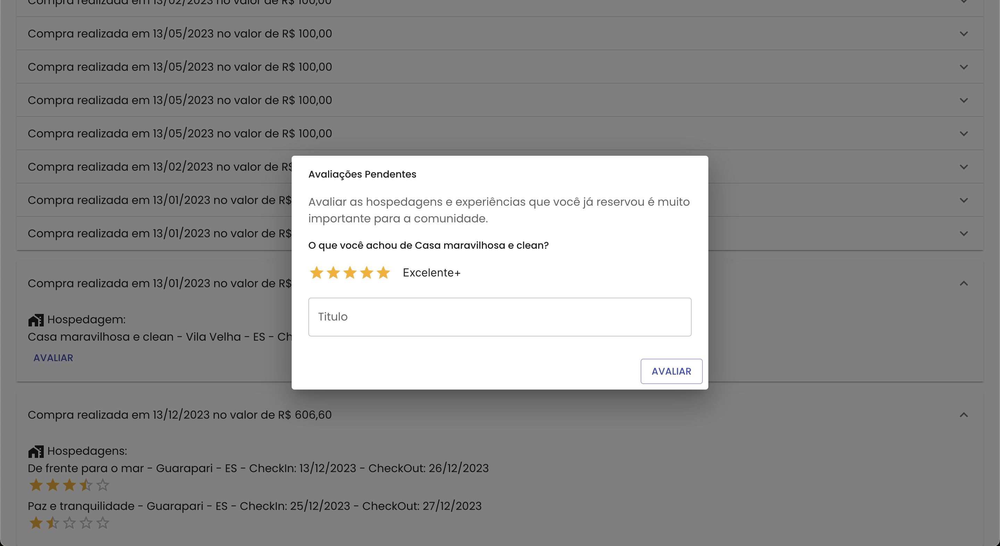
