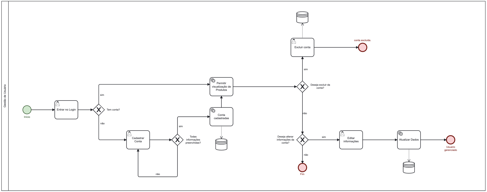

### 3.3.1 Processo 1 – Gestão de Usuário

A Gestão de Usuário diz respeito às atividades referentes ao cadastro do usuário, bem como, a possível edição de suas informações.

#### Detalhamento das atividades

- Entrar no login;
- Cadastrar conta: caso o cliente não tenha uma conta, o sistema começará o cadastro;
- Permitir visualização de Produtos: o sistema direcionará o cliente para a aba de produtos;
- Excluir conta: o cliente solicita a exclusão da própria conta;
- Editar informaçòes: o cliente edita as informações da prórpria conta;
- Atualizar dados: os dados das edições são atualizados.

**Entrar no Login**

| **Campo** | **Tipo**       | **Restrições**                              | **Valor default** |
| --------- | -------------- | ------------------------------------------- | ----------------- |
| login     | Caixa de Texto | formato de e-mail                           |                   |
| senha     | Caixa de Texto | mínimo de 8 caracteres e mínimo duas letras |                   |

| **Comandos** | **Destino**        | **Tipo** |
| ------------ | ------------------ | -------- |
| entrar       | Fim do Processo    |          |
| cadastrar    | Início do cadastro |          |

**Cadastrar conta**

| **Campo**        | **Tipo**         | **Restrições**                     | **Valor default** |
| ---------------- | ---------------- | ---------------------------------- | ----------------- |
| Nome             | String           | max. 20 caracteres                 |                   |
| e-mail           | String           |                                    |                   |
| senha            | String           | min. 6 caracteres                  |                   |
| Telefone Celular | Número           | numero no formato (dd)(nnnnn-nnnn] | (00)(00000-0000)  |
| Imagem de Perfil | Imagem           | formato pdf ou jpg                 |                   |
| Estado           | Seleção única    | escolha do Estado                  | Acre(AC)          |
| Cidade           | Seleção única    | escolha da Cidade                  | Acrelândia        |
| Interesses       | Seleção múltipla | escolha de Interesses              |                   |

| **Comandos** | **Destino**                  | **Tipo** |
| ------------ | ---------------------------- | -------- |
| cadastrar    | Fim do Processo              |          |
| cancelar     | Retorna para a tela de Login | cancel   |

**Editar informações**

| **Campo**        | **Tipo**         | **Restrições**                     | **Valor default**        |
| ---------------- | ---------------- | ---------------------------------- | ------------------------ |
| Nome             | String           | max. 20 caracteres                 |                          |
| e-mail           | String           |                                    |                          |
| senha            | String           | min. 6 caracteres                  |                          |
| Telefone Celular | Número           | numero no formato (dd)(nnnnn-nnnn] | Usuario.numeroCadastrado |
| Imagem de Perfil | Imagem           | formato pdf ou jpg                 | Usuario.imagemPerfil     |
| Estado           | Seleção única    | escolha do Estado                  | Usuario.estado           |
| Cidade           | Seleção única    | escolha da Cidade                  | Usuario.cidade           |
| Interesses       | Seleção múltipla | escolha de Interesses              | Usuario.interesses       |

**Excluir Conta**

| **Comandos** | **Destino**                  | **Tipo** |
| ------------ | ---------------------------- | -------- |
| excluir      | Fim do Processo              |          |
| cancelar     | Retorna para a tela de Login | cancel   |
