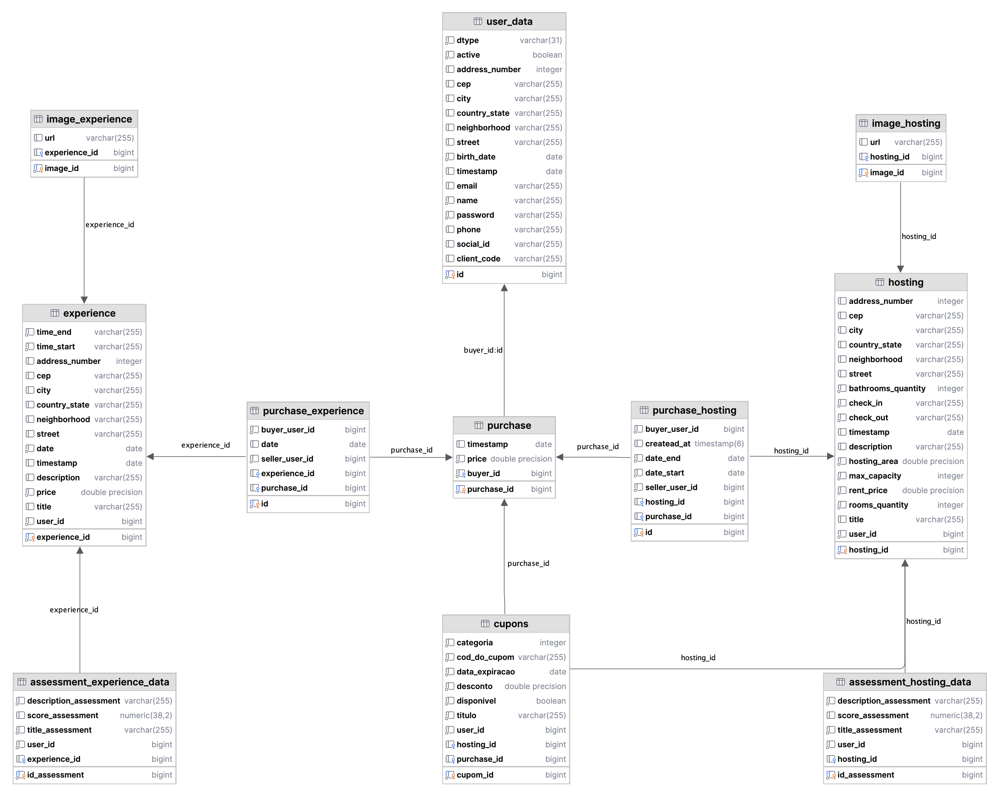
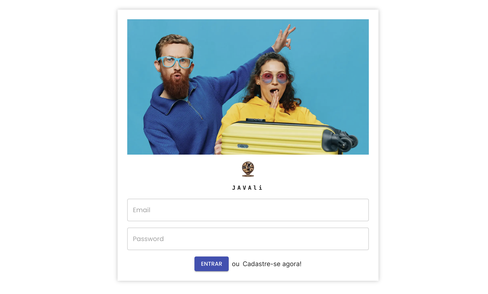
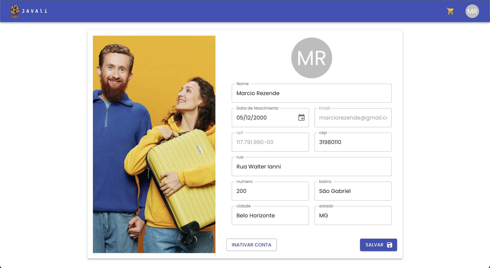
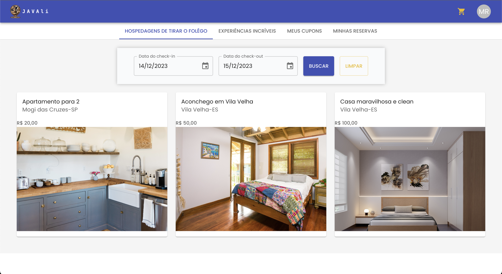
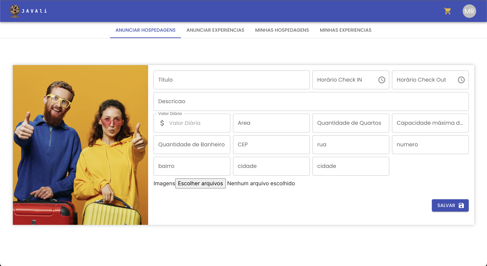
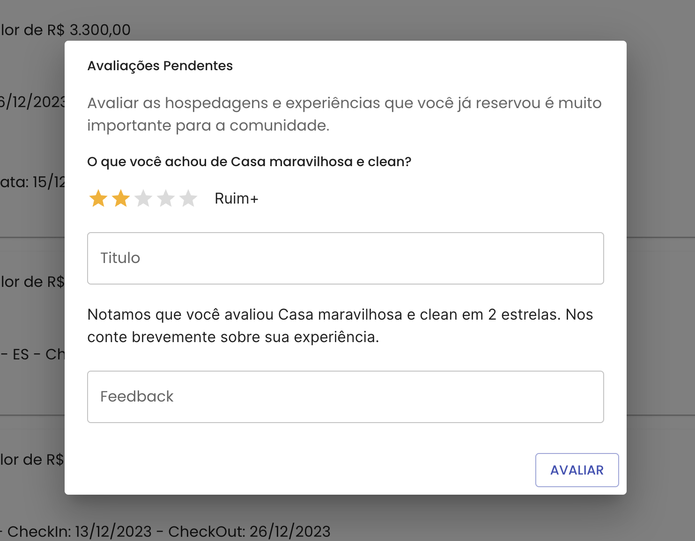
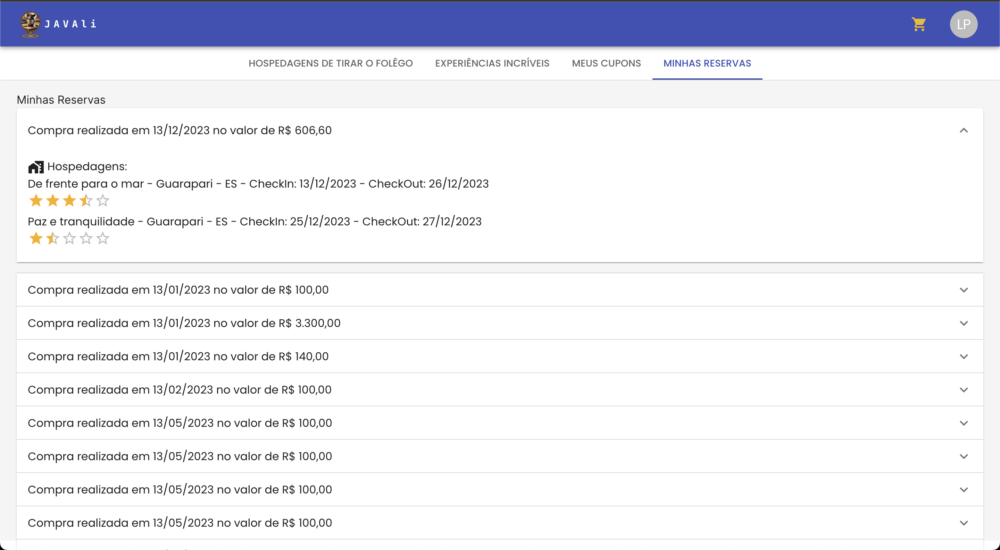

## 4. Projeto da Solução

### 4.1. Diagrama de Classes

Conforme diagrama de classes UML apresentado: as entidades participantes da solução são:

- **User** - Trata-se de uma classe abstrata, que herda outras 2, no qual seriam as entidades: Fornecedor e Cliente, que teriam separadamente seus diferenciais em relação ao usuário, a entidade usuário tem como principal objetivo , realizar a gerência de usuários no sistema, desde a criação a exclusão do mesmo nos dados.

- **Adress** - Entidade responsável por declarar endereços. Possui relacionamento com User, Hosting e Experience.

- **Experience** - Entidade responsável por declarar as experiência disponíveis na aplicação. Possui relacionamento com Adress, AssessmentExpirience, imageExpirience e BuySellExperience.

- **Hosting** - Entidade responsável por declarar as hospedagens disponíveis na aplicação. Possui relacionamento com Adress, AssessmentHosting, imageHosting e BuySellHosting

- **AssessmentExperience** - Responsável por declarar as avaliações que serão criadas após a compra de uma Experience. Possui relação com Experience.

- **AssessmentHosting** - Responsável por declarar as avaliações que serão criadas após a compra de uma Hosting. Possui relação com Hosting.

- **ImageExperience** - Responsável por realizar a declaração e manipulação de imagens usadas ao se cadastrar uma Experience.

- **imageHosting** - Responsável por realizar a declaração e manipulação de imagens usadas ao se cadastrar uma Hosting.

- **buySellHosting** Responsável pelas manipulações de compra e venda de hospedagem.

- **buySellExperience** - Responsável pelas manipulações de compra e venda de experiência.

- **Purchase** - Classe que relacionará todos os atributos necessários de uma compra, possui relação com buySellHosting, buySellExpirience e Cupons.

- **Cupons** - Classe responsável pela declaração de cupons de desconto que serão usados nas compras da aplicação. Possui relação com Purchase.

- **Client e Supplier** - Classes filhas de User criadas para auxiliar nos processos referêntes à usuário.

### 4.2. Modelo de dados

### 4.3. Tecnologias

| _Dimensão_     | _Tecnologia_ |
| -------------- | ------------ |
| Front end      | React.js     |
| Ícones         | Heroicons    |
| CSS            | Tailwind CSS |
| Back end       | SpringBoot   |
| Log do sistema | Log4J        |
| Deploy         | Github Pages |

### 4.5. Guias de estilo

## Design

login:

Perfil:

Hospedagens:

Cadastro de Hospedagem:

Avaliações:

Reservas:

## Cores

## Tipografia

Para o projeto, foi escolhido a fonte 'Poppins' como a fonte principal. A seguir é descrito os tamanhos e estilos de fonte de acordo com o texto:

- `h1`: Tamanho de fonte de 36px, regular, cor #333
- `h2`: Tamanho de fonte de 24px, regular, cor #333
- `h3`: Tamanho de fonte de 20px, regular, cor #333
- `h4`: Tamanho de fonte de 18px, regular, cor #333
- `label`: Tamanho de fonte de 18px, semi-bold, cor #333,
- `p`: Tamanho de fonte de 16px, regular, cor #333.

## Iconografia

- Logo do Projeto:

Os demais icones utilizados no projeto pertencem a biblioteca [MaterialIcons](https://mui.com/material-ui/material-icons/).
